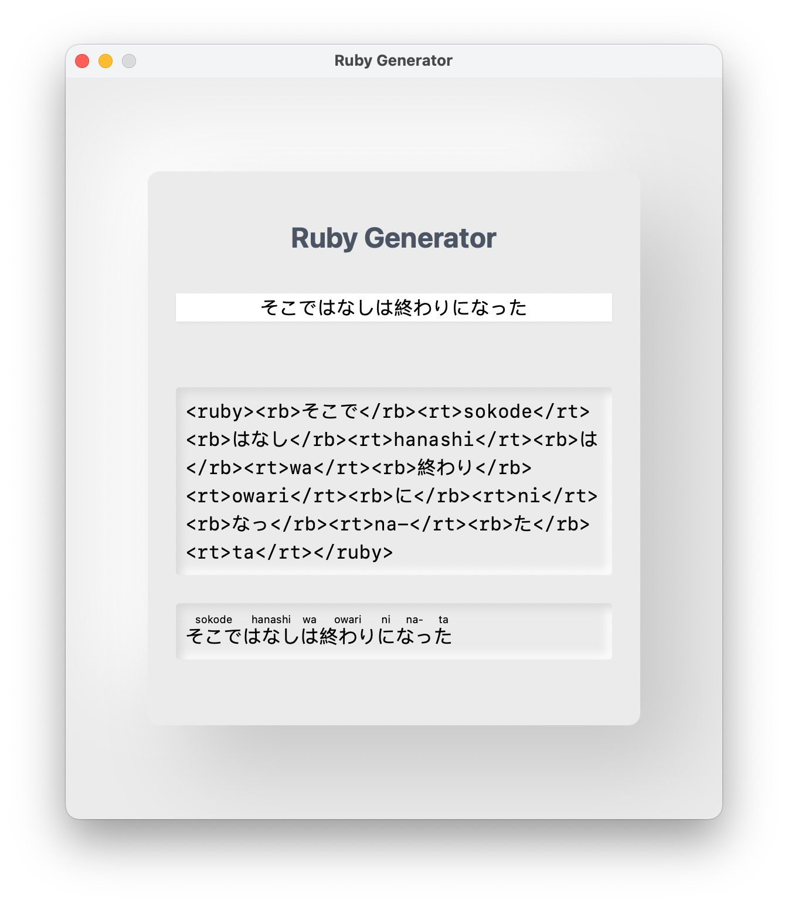

# Ruby Generator

[English](#english) [简体中文](#chinese)

## English

The `<ruby>` HTML element represents small annotations that are rendered above, below, or next to base text, usually used for showing the pronunciation of East Asian characters. It can also be used for annotating other kinds of text, but this usage is less common.

This is a tool can generate romaji ruby tag from the Japanese text.

---

## 简体中文

HTML`<ruby>`元素 被用来展示东亚文字注音或字符注释。

这是一款可以从输入的日文生成罗马音ruby标签的工具。